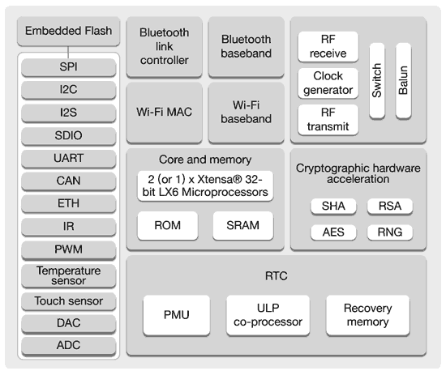

## ESP32

El módulo ESP32 del fabricante Espressif se ha convertido en un auténtico estándar del mundo maker

Este módulo es lo que se conoce como un System on Chip, un módulo que incluye todo lo necesario para operar el sistema (CPU, RAM, flash,....)

* Procesador Xtensa LX6 de 32 bits con doble core a 160Mhz 
* RAM de 520Kb
* Flash de hasta 16Mb
* Wifi
* Bluetooth v4.2
* 32 pines GPIO
* 18 canales ADC de 12 bits
* 2 DAC de 9 bits
* 16 salidas PWM
* Protocolos:
    * I2C
    * SPI
    * I2S
    * CAN
    * ...

Muchos fabricantes han creado diferentes placas a partir de este módulo. Vamos a ver algunos de ellos.

## Wemos D1 R32

Esta placa basada en ESP32 conserva el formato físico de las placas Arduino UNO, lo que nos permite usar la mayoría de los escudos (shields) existentes

### Correspondencia pines Arduino/GPIO ESP32

    LED_BUILTIN = 2

    D2 = 26
    D3 = 25
    D4 = 17
    D5 = 16
    D6 = 27
    D7 = 14
    D8 = 12
    D9 = 13
    D10 = 5
    D11 = 23
    D12 = 19
    D13 = 18
    A0 = 2
    A1 = 41
    A3 = 34
    A4 = 36
    A5 = 39

