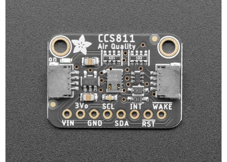
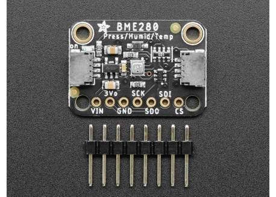
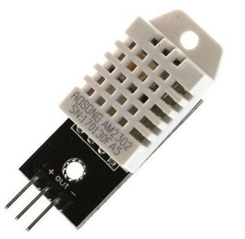

## Componentes

Además del ESP32 usaremos algunos sensores;

### ccs811

[Sensor de eVOC](https://tienda.bricogeek.com/co2/1508-sensor-de-calidad-del-aire-ccs811-voc-y-co2.html?search_query=ccs811&results=1): midiendo las concentraciones de varios gases determina una concentración equivalente de CO2 o eCO2 y una medida de calidad del aire eVOC

Existen en diferentes formatos

### BME280

[Sensor atmosférico](https://tienda.bricogeek.com/sensores-temperatura/1116-sensor-de-temperatura-humedad-y-presion-bme280.html?search_query=BME280&results=3) de gran calidad que nos permite medir temperatura, humedad del aire y presión atmosférica 

### DHT22

[Sensor atmosférico](https://solectroshop.com/en/sensores-de-humedad/758-dht22-am2302-sensor-temperatura-humedad-pcb-cable-arduino-digital.html) de bajo coste que nos permite medir humedad y temperatura.

