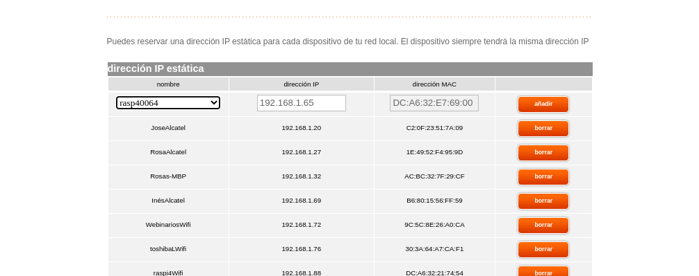

# Instalamos el SO

Raspbery pi imager

Raspberry Pi OS ¿escritorio?  ¿lite? ¿full? ¿64? 


Configuramos 
* ssh
* wifi
* ¿usuario?
* password

Arrancamos

* Actualizamos
* Activamos VNC
* ¿Otros interfaces?
* ¿Cámara?


# IP fija



ifconfig

# Acceso

* Desde consola con ssh: [Putty](https://www.chiark.greenend.org.uk/~sgtatham/putty/latest.html)/ssh

* Acceso a escritori con [VNC](https://www.realvnc.com/es/connect/download/viewer/windows/)

# Programación


## IDE Thonny

Instalado por defecto en raspberry pi, para instalación https://thonny.org


## VSCode - opcional

[Descarga](https://code.visualstudio.com/download)

Versión ARM para Rsudo aspberry Pi ¿64?


```sh
sudo dpkg -i Download/code_1.64.2_arm64.deb
```


