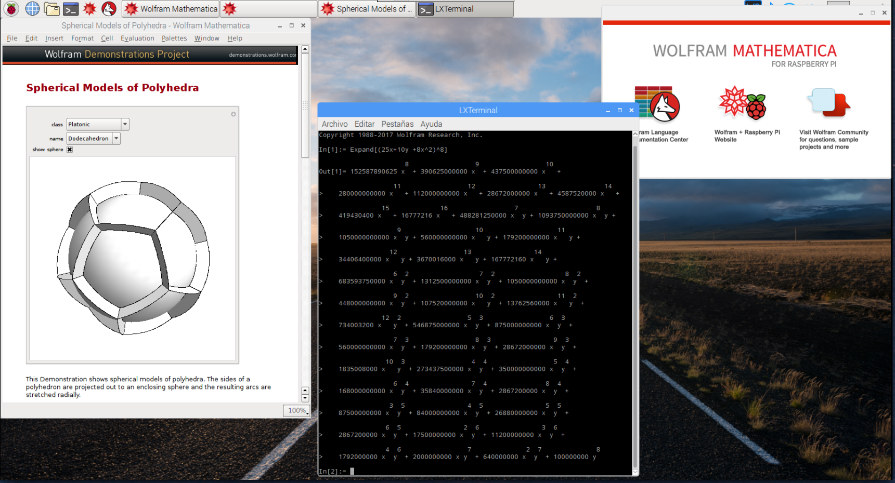

## Manejando tu Raspberry Pi

Como sabes Raspberry es una máquina Linux, con lo que podrás manejarla igual que se maneja cualquier otro equipo Linux.

### Capturas de la pantalla

Podemos hacer capturas del escritorio usando la tecla **Imprimir Pantalla** si nuestro teclado la tiene o bien usando el comando **Scrot**, que pondrá un fichero con la captura en directorio home del usuario (/home/pi por defecto) con un nombre dado por la fecha, hora y resolución. Por ejemplo "2021-02-26-194221_1024x768_scrot.png".

Podemos hacer que la captura se haga después de un determinado retardo usando la opción **-d**. Por ejemplo para hacer la captura a los 10 segundos. 

```sh
scrot -d 10
```

También podemos darle un nombre concreto al fichero resultado al usar el comando

```sh
scrot ficheroCaptura.png
```

Si necesitamos más opciones podemos instalar un programa como **Gnome Screenshot** que nos dará más opciones. Lo instalaremos como siempre con

```sh
sudo apt install gnome-screenshot
```
Y aparecerá en el menú de "Accesorios"

Nos permitirá capturar todo el escritorio, una ventana, una zona, definiendo un determinado retardo. También nos permite tras hacer la captura seleccionar el nombre y carpeta del fichero o si queremos que se copie la imagen en el clipboard.


### Consola (línea de comandos)

Podemos hacer casi todo desde el habitual entorno gráfico, pero también desde el terminal o la consola, también llamada línea de comandos.

Si te acostumbras a usarla verás que ganas en productividad y además verás que puedes automatizar muchas tareas. 


#### Comandos básicos:

Como ya hemos dicho, Raspbian es una versión de [Linux](https://es.wikipedia.org/wiki/GNU/Linux), que no es más que una versión moderna del sistema operativo [Unix](https://es.wikipedia.org/wiki/Unix). Por esto tenemos acceso a los comandos de esos sistemas operativos.

Veamos algunos de los comandos más utilizados:

* La tecla Tabulador nos permite completar el nombre del fichero/directorio
* **ls** : muestra los archivos y directorios ( **ls -l** para más detalles y **ls -a** para mostrar todos)
* **cd** : cambia de directorio (**cd ~** nos lleva a nuestro directorio home y **cd ..** sale del directorio actual)
* **chmod** : cambia los permisos de un fichero/directorio (**chmod ugo-w fichero** quita todos los permisos de escritura)
* **pwd** : nos dice el directorio actual
* **mv** : mueve directorios/ficheros a un nuevo destino
* **rm** : borra directorios/ficheros
* **mkdir** : crea un directorio
* **passwd** : cambia la contraseña del usuario actual
* **ps -ef** : muestra los procesos en ejecución
* **top** : administrador de tareas
* **clear** : borra todo el contenido del terminal
* **df** : muestra el % de disco ocupado
* **nano** : editor de texto básico
* **vi** : editor de texto avanzado pero complejo
* **du** : muestra lo que ocupa un directorio (**du -s *** muestra lo que ocupa un directorio y todo lo que contiene)
* **sudo halt** apaga la raspberry
* **sudo shutdown -h now** apaga la raspberry
* **history** : muestra todos los comandos que se han ejecutado antes. Podemos ejecutar el comando de la posición n, con !n . Las teclas abajo/arriba del cursor nos permiten iterar por los comandos usados.
* **man comando**: Para obtener ayuda sobre comando
* Para hacer fichero script: añadimos los comandos, chmod u+x fichero y para ejecutarlo ./fichero

[](https://drive.google.com/file/d/1a2UjGmzv0XXMpadJ1iItbat_ibDuG6Sl/view?usp=sharing)

[Vídeo: Uso del terminal y comandos Linux en Raspberry Pi](https://drive.google.com/file/d/1a2UjGmzv0XXMpadJ1iItbat_ibDuG6Sl/view?usp=sharing)

#### Estructura de directorios y ficheros

Algunas características de sistema de fichero de linux

* Usa un formato de partición ext4 (también existen aunque en desuso el ext3 y el ext2), aunque permite usar FAT, el típico sistema de archivos de Windows.
* El árbol de directorios tiene un único directorio raíz del que cuelga todo. Todos los dispositivos (pendrives, discos externos, discos de red) se integran dentro de este árbol, **montando** su raíz en un directorio determinado (montamos y desmontamos con __mount__ y __unmonut__ )

El usuario sólo acceso a su directorio y el solo el administrador (**root**) puede acceder al resto de directorios

##### Algunos directorios

* / directorio raiz
* /etc configuración
* /home usuario
* /usr programas para usuarios
* /usr/share recursos de programas (imágenes, traducciones)
* /usr/share/doc documentación
* /bin ejecutables del sistema
* /lib librerías
* /boot Arranque del sistema
* /usr/bin ejecutables para usuarios
* /media o /mnt punto de montaje de dispositivos de almacenamiento externo


#### Usuarios

El usuario por defecto es "**pi**" con contraseña "**raspberry**" por defecto

#### Cuidado con sudo

Los usuarios normales pueden hacer muchas cosas, pero las tareas más importantes (y por tanto peligrosas si se hacen mal), como pueden ser la configuración o borrado de ficheros críticos no están permitidas.

Esas tareas sólo las puede hacer el usuario administrador, llamado **root**, que puede hacer cualquier cosa. 

Como hay veces que un usuario necesita hacer alguna de estas tareas, por ejemplo editar un fichero de configuración, podemos solicitar permisos para hacer esa tarea anteponiendo al comando la palabra "sudo". Algunas acciones nos pedirán que introduzcamos el password de nuestro usuario como medida de seguridad.	

Por ejemplo si queremos editar un fichero de la carpeta de configuración etc llamado ftab, haremos

```sh
sudo geany /etc/fstab
```
	
geany es el editor de ficheros de texto, y al usar "sudo" estamos pidiendo permiso para hacer algo como root

Esto nos sirve para ver que podemos abrir aplicaciones de escritorio desde la consola.

Si en un momento dado necesitamos hacer muchas tareas como root podemos abrir una consola con este usuario haciendo

```sh
sudo su -
```

Pero mucho cuidado que esto nos da todo el poder del usuario administrador(**root**) y por tanto toda la responsabilidad

### Interface gráfico

Para arrancar el interface gráfico desde consola si no está arrancado usando
```sh
startx
```


### Acceso remoto

Algo muy frecuente es que queramos acceder a nuestra Raspberry Pi remotamente, es decir sin un teclado ni monitor conectado directamente. Evidentemente necesitamos tener un SO instalado y habilitar el acceso remoto. Veamos algunas de las formas de hacerlo.

### SSH (vía consola)

SSH es el protocolo de acceso remoto por consola (o terminal). Se suele utilizar cuando no necesitamos (o no tenemos) un entorno gráfico. Es una forma de conexión segura (usa encriptación y verificación a ambos lados) utilizada para acceder a router y otros dispositivos remotos

Tenemos que activarlo en la configuración para poder acceder desde fuera.Entramos en la configuración avanzada

```sh
sudo raspi-config
```


Podemos hacerlo también por comandos con

```sh
sudo service ssh start
sudo insserv ssh
```

Ahora podremos conectarnos remotamente con ssh, desde Linux con el comando **ssh** o con otras herramientas que veremos a continuación

```sh
ssh pi@192.189.0.123
```

Si lo vamos a activar se recomienda cambiar la contraseña para evitar que cualquiera pueda acceder a nuestro equipo.

[](https://drive.google.com/file/d/1Eu0yXNhgxUOZj9TjB35dlq-3y1--L4Lq/view?usp=sharing)

[Vídeo: Conexión vía SSH a Raspberry Pi](https://drive.google.com/file/d/1Eu0yXNhgxUOZj9TjB35dlq-3y1--L4Lq/view?usp=sharing)


### Herramientas de conexión ssh

Son muchas las herramientas que existen para poder conectarnos entre equipos usando SSH, vamos a ver un par de ellas.

#### Putty 


[Putty](http://www.chiark.greenend.org.uk/~sgtatham/putty/download.html) es una herramienta open source disponible para muchos sistemas operativos pensada para conectar remotamente con equipos usando distintos protocolos como ssh, telnet, serie, etc


Permite guardar las credenciales de cada sistema, facilitando la conexión.

#### JuiceSSH

[JuiceSSH](https://play.google.com/store/apps/details?id=com.sonelli.juicessh) es una herramienta de conexión ssh para móviles y tabletas Android.

También nos permite gestionar las credenciales de acceso y los diferentes equipos a los que conectarnos:


El uso incluso en un móvil es más cómodo de lo que parece, puesto que permite el uso de teclas como TAB, ctrl, cursor, etc.


[](https://drive.google.com/file/d/1GG4mscjTBS9VqsDxgyXM6n1UopfQzrIB/view?usp=sharing)

[Cliente SSH para móviles y tabletas Android: juicceSSH](https://drive.google.com/file/d/1GG4mscjTBS9VqsDxgyXM6n1UopfQzrIB/view?usp=sharing)

### Automatizar conexiones

Si vamos a conectarnos frecuentemente a un mismo equipo puede resultar pesado tener que poner siempre usuario y contraseña. 

Podemos automatizar el protocolo ssh sin más que añadir nuestra **clave pública ssh** a la lista de host autorizados del servidor al que nos vamos a conectar, haciendo lo siguiente:

1. Generar nuestra **clave pública ssh**, asociada al usuario y la máquina
```sh
ssh-keygen -t rsa -b 4096 -C user@email.com
```
2. Ahora copiamos nuestra clave pública ssh a 
```sh
cat ~/.ssh/id_rsa.pub | ssh username@server.address.com 'cat >> ~/.ssh/authorized_keys'
```
La siguiente vez que nos conectemos lo haremos sin necesidad de introducir la clave.

Como podemos ver en el último comando que hemos usado, podemos usar ssh de muchas formas diferentes:

* Para conectarnos de manera interactiva a otro ordenador.
* Para enviar ficheros entre equipos. En un proyecto más adelante lo usaremos bastante.
* Para enviar contenido entre equipos como hemos hecho con el comando 'cat'.
* Para ejecutar comandos remotamente. Por ejemplo si hacemos:
```sh
ssh pi@raspi4 df -h
```
Nos permitirá saber cómo de llenos están los discos en el ordenador raspi4.


### VNC

VNC es un protocolo que nos permite acceder remotamente al escritorio de otra máquina.

En las nuevas versiones de Raspbian podemos activar VNC desde la configuración (o desde raspi-config), en el apartado de Interfaces


## Usos

Veamos cómo podemos utilizar lo aprendido...

### Para hacer cálculos con Mathematica

Hay una versión gratuita (para uso no comercial) de Wolfram  Mathematica instalada por defecto en Raspbian



[](https://drive.google.com/file/d/1oXjMaNmL4gpaTHPePZYbIb6_lRsAGODi/view?usp=sharing)


[Vídeo: Trabajando con Mathematica en Raspberry](https://drive.google.com/file/d/1oXjMaNmL4gpaTHPePZYbIb6_lRsAGODi/view?usp=sharing)


## Mantenimiento

Una vez instalado el sistema, necesitamos de vez en cuando actualizarlo. Veamos cómo hacerlo.

### Actualización (update)

Desde un terminal/consola tecleamos lo siguiente

Para buscar cambios en los repositorios:

```sh
sudo apt update
```

Para instalar estos cambios:

```sh
sudo apt upgrade
```

Para actualizar el sistema, no sólo actualizando los paquetes:

```sh
sudo apt dist-upgrade
```

Para actualizar a una nueva distribución (si está disponible):

```sh
sudo apt full-upgrade
```

Para instalar un paquete determinado, haremos lo siguiente:

```sh
sudo apt install paquete
```

Vemos como en todos los comandos utilizamos la palabra "sudo" esto es debido a que se necesitan privilegios de administrador para todo lo relacionado con la actualización del sistema.

[](https://drive.google.com/file/d/1tWwCM229eJSLx0h_iZxk-3A7VHJu2jYr/view?usp=sharing)


[Vídeo: Actualizar e instalar software desde terminal en Raspberry Pi](https://drive.google.com/file/d/1tWwCM229eJSLx0h_iZxk-3A7VHJu2jYr/view?usp=sharing)


### Eliminación de paquetes obsoletos

Con la instalación y actualización de los paquetes, a lo largo de tiempo, algunas de las dependencias se quedan obsoletas e incluso algunos de los paquetes puede que ya no sean necesarios. 

Por eso es necesario que cada cierto tiempo eliminemos los paquetes  "huérfanos" que ya no se necesitan por el sistema haciendo:

```sh
sudo apt autoremove
```

También podemos hacer:

```sh
sudo apt autoclean
```

Para eliminar los paquetes que ya quedaron obsoletos.

#### Actualización de los distintos firmwares

Los diferentes componentes de la Raspberry necesitan de varios firmwares para funcionar, que también conviene tener actualizados. Podemos actualizarlos con:

```sh
sudo rpi-update
```

Hay que tener **cuidado con este comando**: si actualizamos un firmware pero el sistema operativo no lo está y por tanto espera encontrar una versión anterior del firmware, podemos encontrarnos con que nuestra Raspberry se queda completamente bloqueada.

A veces puede ocurrir que nos encontremos con que un cambio nos da algún problema que antes no teníamos. En ese caso podemos volver a la versión anterior estable haciendo lo siguiente

```sh
sudo apt-get update
sudo apt-get install --reinstall libraspberrypi0 libraspberrypi-{bin,dev,doc} raspberrypi-bootloader
sudo reboot
```

#### Actualización de una versión a la siguiente

Aunque es conveniente que cuando salga una nueva versión hagamos una instalación desde cero, a veces tenemos muchas aplicaciones instaladas o mucha información del usuario que nos llevaría mucho tiempo extraer y luego volver a copiar/instalar. En ese caso nos podemos plantear hacer una actualización de una versión a otra.

Vamos a ver un ejemplo de cómo actualizar de una versión del SO a la siguiente. En este caso particular cómo pasar de "Stretch" a "Buster".

1. Modificamos la versión a la apuntan los repositorios de 'stretch' a 'buster'. Podemos hacerlo cambiando a mano el ficheros **/etc/apt/sources.list** y **/etc/apt/sources.list.d/raspi.list** o con un comando como el siguiente:

    ```sh
    grep -rl stretch /etc/apt/ | sudo xargs sed -i 's/stretch/buster/g'
    ```

2. Actualizamos el sistema completamente:

    ```sh
    sudo apt update
    sudo apt dist-upgrade
    sudo apt full-upgrade
    ```

3. Actualizamos los firmwares:

    ```sh
    sudo rpi-update
    ```

4. Quitamos aplicaciones que ya no están en buster

    ```sh
    sudo apt purge timidity lxmusic gnome-disk-utility deluge-gtk evince wicd wicd-gtk clipit usermode gucharmap gnome-system-tools pavucontrol
    ```

5. Ahora actualizamos el aspecto con la nueva configuración visual abriendo ‘Appearance Settings’ y en la pestaña ‘Defaults’ pulsamos ‘Set Defaults’ lo que debería ponernos un tamaño de fuente y de iconos acorde a la resolución usada.

Podemos hacer este cambio entre diferentes versión con sólo cambiar los nobmres de las versiones

#### Instalación de programas

Además de la línea de comandos, siempre podemos instalar desde la herramienta visual "Añadir programas" en el menú Preferencias.

[](https://drive.google.com/file/d/1c_LRoSGBBeoYAdmiOQ91qIT4NKQxBLS-/view?usp=sharing)


[Vídeo: Cómo actualizar e instalar software Raspberry Pi](https://drive.google.com/file/d/1c_LRoSGBBeoYAdmiOQ91qIT4NKQxBLS-/view?usp=sharing)

#### Instalación de paquetes a partir del código fuente

* Descargamos el código fuente (normalmente comprimido)
* Lo descomprimimos con
```sh
unzip codigo_fuente.zip
```
ó
```sh
tar xvf codigo_fuente.tgz
```
(según el formato en el que esté comprimido)

Dentro del directorio del código ya descomprimido normalmente encontramos un fichero README o INSTALL que nos dará las instrucciones, pero suelen ser muy parecidas a estas:

Preparan el código para que compile en nuestro sistema y además comprueban que tengamos las herramientas y librerías necesarias con:
```sh
cmake .
```
ó
```sh
configure
```
Compila el código y generamos un ejecutable
```sh
make
```
Lo instalamos en el sistema (por eso necesitamos usar sudo)
```sh
sudo make install
```
