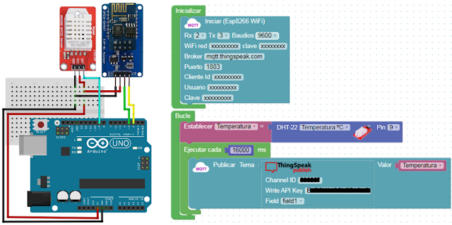
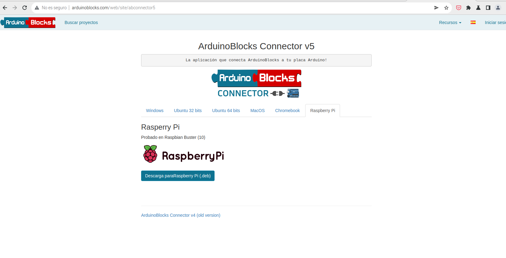

### ArduinoBlocks

[ArduinoBlocks](https://arduinoblocks.com) es un entorno de programación de bloques para Arduino, ESP32, ... muy recomendado para iniciarse en estos temas.



Para poder pasar los programas a las placas tenemos que instalar "ArduinoBlock Connector". Lo descargamos en su versión para Raspberry:



Y lo instalamos:

```sh
sudo dpkg -i Downloads/abconnector_v5_rpi.deb
```

Que tendremos que ejecutarlo cuando queramos transferir nuestro programa a la placa

