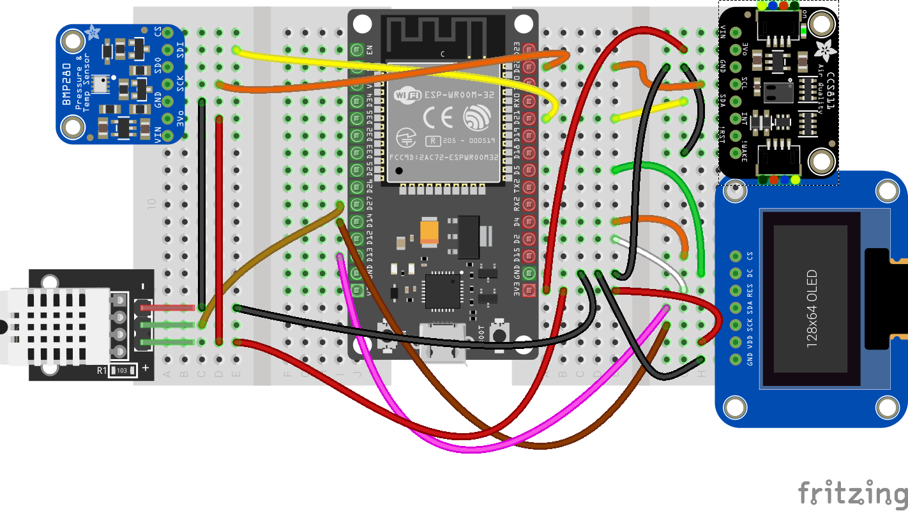

## Sensor atmosférico BME280

Para mejorar la calidad de la medida vamos a añadir un sensor atmosférico BME280 que se conecta también por I2C



Descargamos el módulo [BME280](https://raw.githubusercontent.com/javacasm/CursoIOT_adv/main/codigo/bme280/BME280.py)

Un sencillo [test](https://raw.githubusercontent.com/javacasm/CursoIOT_adv/main/codigo/bme280/BME280_test.py)

```python
## Medida de temperatura, humedad y presion ocn sensor BME280 ma
import machine # Usaremos los pines y el I2C
import BME280  # Importamos la clase BME280
import config

def testBME280():
    i2c = machine.SoftI2C(sda = machine.Pin(config.pinSDA),scl = machine.Pin(config.pinSCL)) # configuramos el acceso al bus i2c 
    i2c.scan() # Comprobamos que se detecta el dispositivo en la direccion 0x76 (118) 
    bme = BME280.BME280(i2c = i2c, address=0x76) 
    print('Temp: '+str(bme.temperature) + ' Pres: '+ str(bme.pressure) + ' Hum: '+str(bme.humidity))
```

