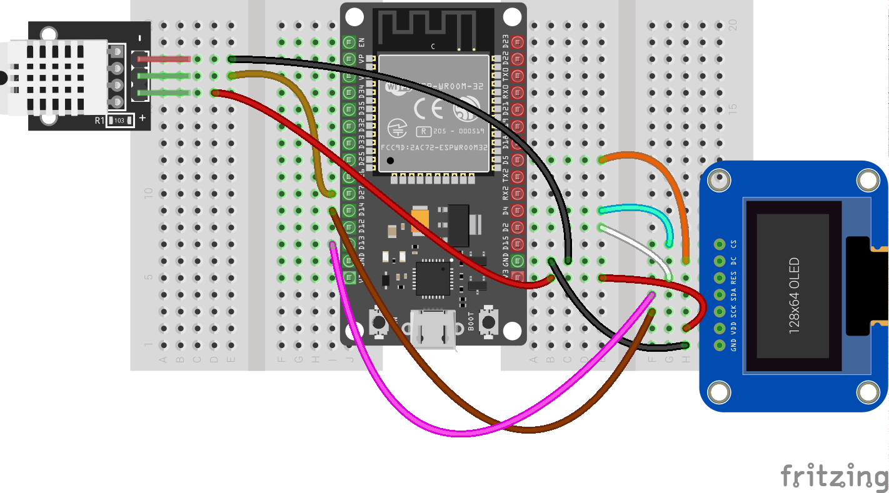

# Pantalla Oled - SPI

Descargamos el módulo para manejar pantallas oled con el chip[sh1106](https://raw.githubusercontent.com/javacasm/CursoIOT_adv/main/codigo/oled/sh1106.py).

Usaremos la conexión SPI, que tiene nuestra pantalla:



Conectamos la pantalla OLED y un DHT22 para probar 

Los pines SPI (que no podemos cambiar):

GPIO 13  - Din / MOSI
GPIO 14  - Clk / SCLK 

Los restantes pines de control, que podemos cambiar:

GPIO 4   - CS_PIN   ( Opcional si hay 1 solo dispositivo SPI)
GPIO 2   - RES_PIN
GPIO 5   - DC_PIN

El [programa](https://raw.githubusercontent.com/javacasm/CursoIOT_adv/main/codigo/oled/test_oled_sh1106.py) quedaría asi:

```python
import machine
import sh1106
import time
import dht

oled_width = 128
oled_height = 64

'''
Pines SPI
GPIO 13  - Din / MOSI
GPIO 14  - Clk / SCLK 
'''
# Se pueden cambiar
CS_PIN = 4  # Opcional si hay 1 solo dispositivo SPI
RES_PIN = 2 
DC_PIN = 5  

spi = machine.SPI(1, baudrate=1000000)
display = sh1106.SH1106_SPI(oled_width, oled_height,
                            spi,
                            machine.Pin(DC_PIN),
                            machine.Pin(RES_PIN),
                            machine.Pin(CS_PIN))
display.sleep(False)

PIN_DHT = 27
dht22 = dht.DHT22(machine.Pin(PIN_DHT))

def test():
    display.fill(0) # Rellenamos de negro
    display.text('Testing 1', 0, 0, 1)
    display.show() # Necesario para que se actualice

def getLocalTimeHumanFormat():
    strLocalTime = "{3:02}:{4:02}:{5:02} {2:02}{1}{0}".format(*time.localtime(time.time())[0:6])
    return strLocalTime


def showSensorData():

    while True:
        try:
            dht22.measure()
            sTemp = f'Temp: {dht22.temperature():2.1f} C '
            sHum = f'Hum: {dht22.humidity():2.2f} % '
            sTime = getLocalTimeHumanFormat()
            print(sTime)
            print(sTemp)
            print(sHum)
            display.fill(0) # Rellenamos de negro
            display.text(sTemp, 0, 0, 1)
            display.text(sHum, 0, 12, 1)
            display.hline(0,oled_height-12,oled_width,1)
            display.text(sTime,0,oled_height-8,1)
            display.show() # Necesario para que se actualice
        except Exception as e:
            print(f'Error: {e}')        
        time.sleep(1)
```
