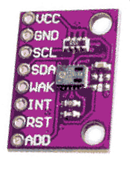
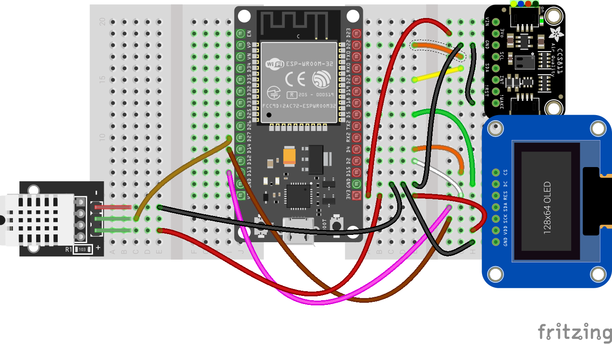

## Medidor de CO2



Vamos a incluir un sensor de **css811** que nos da una medida de calidad del aire y una medida de eCO2, o CO2 equivalente, midiendo para ello la concentración de otros gases como el CO, etanol y otros compuestos orgánicos volátiles.

Es un dispositivo I2C, con lo que la conexión es sencilla, conectando alimentación, SDA, SCL y además tenemos que conectar el pin WAK, que es el pin para activar (WAKE = despertar) del CSS811 a GND



Descargamos el [código del módulo css811.py](https://raw.githubusercontent.com/javacasm/CursoMicropython/master/codigo/P.MedidorCO2/ccs811.py) originario de Adafruit y adaptado a micropython por @ [Notthemarsian](https://github.com/Notthemarsian/CCS811) que incluye interesantes detalles para calibrar el sensor.

Pasamos el módulo a la placa y la usaremos desde nuestro código:

* Importamos el módulo ccs811
```python
import ccs811
```

* Creamos el objeto ccs pasándole el objeto i2c

```python
ccs = ccs811.CCS811(i2c)
```

Podemos preguntar al sensor ya tiene la medida lista y si es así recuperamos los valores:

* **eCO2** una medida de CO2 equivalente, que está entre 400 y 8192 
* **tVOC** que mide los compuestos volátiles entre 0 y 1187

```python
    if ccs.data_ready():
        eCO2 = ccs.eCO2
        tVOC = ccs.tVOC
        sMsg = f'eC02:{eCO2} tVOC:{tVOC}'
        lcd.move_to(0,1)
        lcd.putstr(sMsg)
        print(sMsg)

```

Este sensor, como casi todos los sensores de gases, necesita un periodo de precalentamiento de unos 20 minutos para que se estabilicen las medidas.

Si añadimos esta parte a nuestro programa quedará:

```python
import dht
import machine
import time
import ccs811
import esp8266_i2c_lcd

v = 0.5

dht22 = dht.DHT22(machine.Pin(27)) # inicializamos el sensor dHT22

i2c = machine.SoftI2C(scl=machine.Pin(22), sda=machine.Pin(21)) # creamos el acceso al i2c
lcd = esp8266_i2c_lcd.I2cLcd(i2c, 0x27,2,16)  # creamos el lcd

ccs = ccs811.CCS811(i2c)


lcd.putstr('Medida DHT22 & css811')

while True:
    try:    
        dht22.measure()  # Leemos el sensor
        tempDHT22 = dht22.temperature()
        humDHT22 = dht22.humidity()
        sMsg = f'T:{tempDHT22} H:{humDHT22}'  # creamos una cadena con el contenido a mostrar
        print(sMsg)  # enviamos el mensaje a la consola
        lcd.move_to(0,0) # columna 0, fila 0
        lcd.putstr(sMsg) # enviamos el mensaje al LCD
        if ccs.data_ready():
            eCO2 = ccs.eCO2
            tVOC = ccs.tVOC
            sMsg = f'eC02:{eCO2} tVOC:{tVOC}'
            lcd.move_to(0,1)
            lcd.putstr(sMsg)
            print(sMsg)        
    except:
        print('Error leyendo el sensor')
    time.sleep(1)

```


[](https://drive.google.com/file/d/1eiEnc9TiJ3R8kxZuA6mAZbDNZJuiquXV/view?usp=sharing)

[Vídeo: Medida de temperatura, humedad con DHT22 y eCO2 con css811 usando micropython](https://drive.google.com/file/d/1eiEnc9TiJ3R8kxZuA6mAZbDNZJuiquXV/view?usp=sharing)

## BME280

Para mejorar la calidad de la medida vamos a añadir un sensor atmosférico BME280 que se conecta también por I2C


Descargamos el módulo [BME280](https://raw.githubusercontent.com/javacasm/CursoIOT_adv/main/codigo/bme280/BME280.py)

Un sencillo [test](https://raw.githubusercontent.com/javacasm/CursoIOT_adv/main/codigo/bme280/BME280_test.py)

```python
## Medida de temperatura, humedad y presion ocn sensor BME280 ma
import machine # Usaremos los pines y el I2C
import BME280  # Importamos la clase BME280
import config

def testBME280():
    i2c = machine.SoftI2C(sda = machine.Pin(config.pinSDA),scl = machine.Pin(config.pinSCL)) # configuramos el acceso al bus i2c 
    i2c.scan() # Comprobamos que se detecta el dispositivo en la direccion 0x76 (118) 
    bme = BME280.BME280(i2c = i2c, address=0x76) 
    print('Temp: '+str(bme.temperature) + ' Pres: '+ str(bme.pressure) + ' Hum: '+str(bme.humidity))
```

