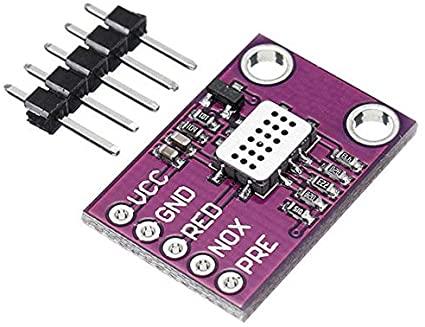
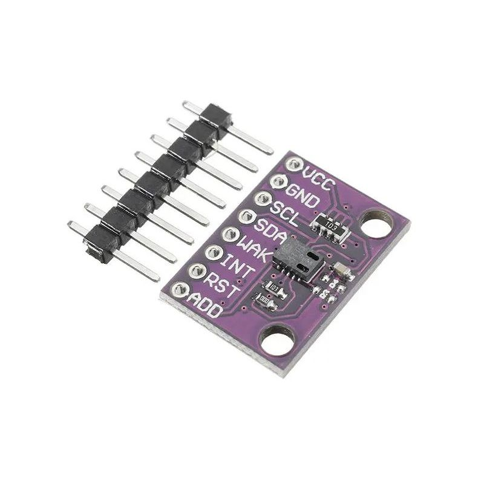

## Sensor CO2 

### mics4514 

Para sus mediciones necesitamos una medida de la temperatura

### ccs811

[Producto](https://solectroshop.com/es/sensores-de-gas/5143-mq-135-sensor-calidad-de-aire.html)

### ¿Lora?

[¿Lora gateway?](https://www.amazon.es/Waveshare-Multi-Level-Configuration-Fixed-Point-Transmission/dp/B07VQZ5ZXY/ref=pd_sbs_1/261-3236229-9801150)